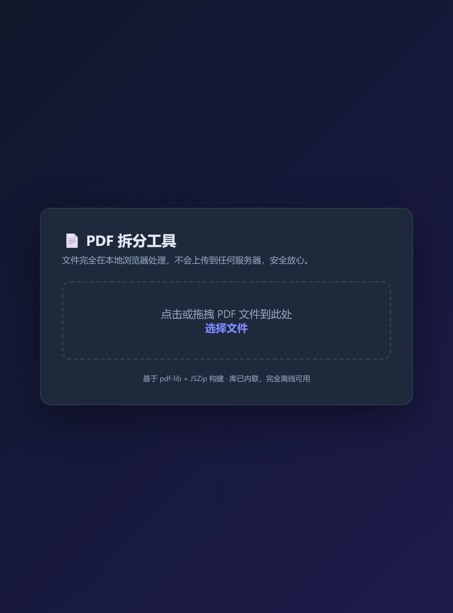
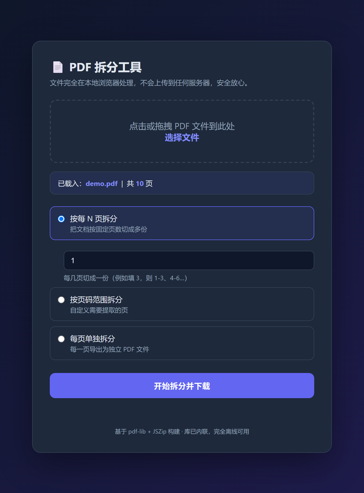
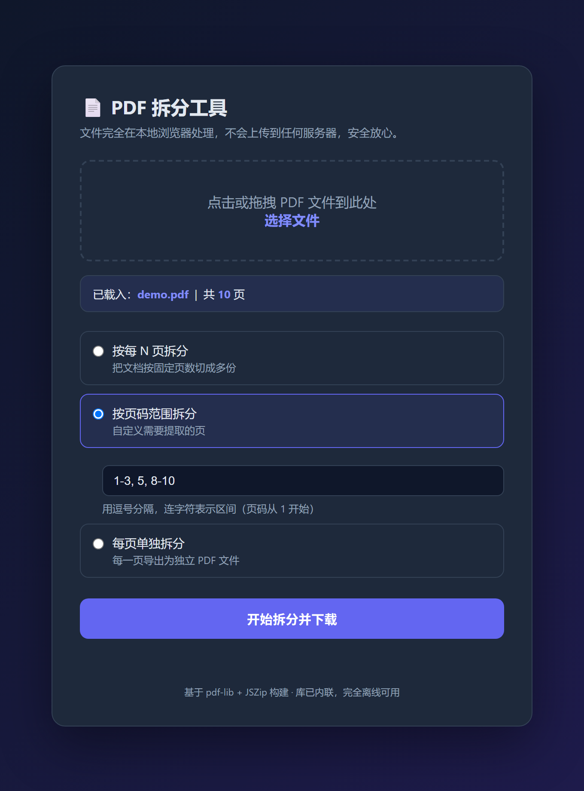
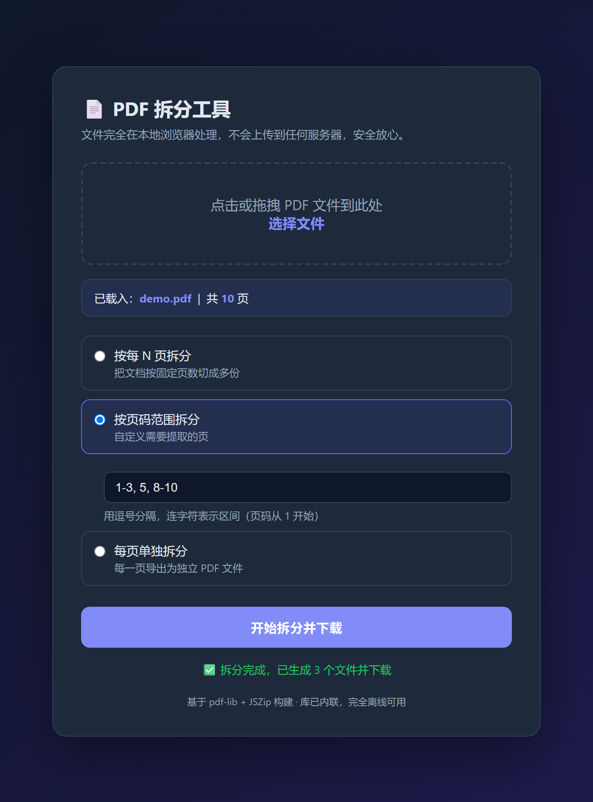

# pdf_spliter — PDF 拆分工具

一个**纯前端、单文件、零安装**的 PDF 拆分工具。用户下载 `pdf_spliter_offline.html` 后，双击用浏览器打开即可弹出交互界面使用，无需安装任何环境，也**完全不需要联网**。

> 仓库地址：https://github.com/KL-cqx/pdf-spliter

## 功能描述

- **按每 N 页拆分**：把一份 PDF 按固定页数切成多份（如每 3 页一份）。
- **按页码范围拆分**：自定义提取页，支持区间与单页混合，例如 `1-3, 5, 8-10`。
- **每页单独拆分**：将每一页导出为独立的 PDF 文件。
- **批量打包下载**：拆分结果自动打包成一个 ZIP 文件一键下载（只有 1 份结果时直接下载 PDF）。
- **本地处理，隐私安全**：文件完全在浏览器本地解析与生成，不会上传到任何服务器。
- **跨平台**：只要有现代浏览器（Chrome / Edge / Firefox 等）即可使用，Windows / macOS / Linux 通用。

## 快速开始

1. 下载 `pdf_spliter_offline.html` 到本地。
2. 双击用浏览器打开，弹出交互界面。
3. 点击或拖拽一个 PDF 文件到界面中。
4. 选择拆分方式并填写参数。
5. 点击「开始拆分并下载」，等待完成后自动下载结果。

## 使用截图

> 以下截图展示真实界面（离线版）。

*图 1：初始界面，点击或拖拽 PDF 文件到虚线框。*

*图 2：载入文件后显示页数，并出现三种拆分模式。*

*图 3：选择「按页码范围拆分」并填入 `1-3, 5, 8-10`。*

*图 4：点击开始后，生成结果并自动下载。*

## 具体使用示例

### 示例 A：一份 10 页的文档，按每 3 页拆成多份

- 模式：按每 N 页拆分
- N 填写：`3`
- 结果：生成 4 个文件，页数分别为 `3 / 3 / 3 / 1`（最后一份不足 3 页，保留剩余页）。

| 输出文件 | 包含页码 |
| --- | --- |
| `001_p1-3.pdf` | 第 1–3 页 |
| `002_p4-6.pdf` | 第 4–6 页 |
| `003_p7-9.pdf` | 第 7–9 页 |
| `004_p10-10.pdf` | 第 10 页 |

### 示例 B：只提取需要的页面 `1-3, 5, 8-10`

- 模式：按页码范围拆分
- 填写：`1-3, 5, 8-10`
- 结果：生成 3 个文件，页数分别为 `3 / 1 / 3`。

| 输出文件 | 包含页码 |
| --- | --- |
| `001_p1-3.pdf` | 第 1–3 页 |
| `002_p5-5.pdf` | 第 5 页 |
| `003_p8-10.pdf` | 第 8–10 页 |

> 语法说明：用逗号 `,` 分隔多项；用连字符 `-` 表示区间；页码从 1 开始。
> 错误示例会被拦截并提示，例如 `1-20`（超出总页数）、`abc`（非法字符）。

### 示例 C：把每一页都拆成独立文件

- 模式：每页单独拆分
- 结果：10 页文档生成 10 个文件 `001_p1-1.pdf` … `010_p10-10.pdf`，每份 1 页。

## 下载内容说明

打包目录包含：

- `pdf_spliter_offline.html` —— **主程序（离线完全版）**，双击即用，断网可用。
- `readme.md` —— 本说明文档。
- `screenshots/` —— 使用截图。

如果这个工具对你有帮助，欢迎请作者喝杯咖啡 ☕

